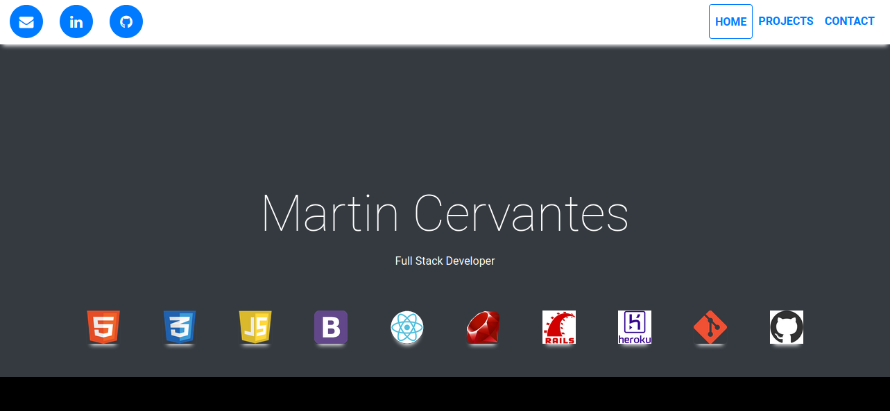

# Portafolio

This project is to create a super portfolio and show the great projects that I have done so far because what is coming will be even better since I like to keep learning and improving my skills, I am always thinking about doing new things and moving forward.

## :package: Built With

    - HTML5
    - CSS3
    - Font-Awesome
    - Bootstrap4
    - jQuery

## :mag: Live Demo

[Live Demo Link](https://mcervantes71.github.io/mcervantes71/index.html)

## :busts_in_silhouette: Authors

👤 **Martin Cervantes**

- Linkedin: [Martin Cervantes](https://www.linkedin.com/in/cervantesmartin/)
- Twitter: [@M4rt1nC3rv4nt3s](https://twitter.com/M4rt1nC3rv4nt3s)
- Github: [@mcervantes71](https://github.com/mcervantes71)
- Gmail: [cervantes.martine](mailto:cervantes.martine@gmail.com)

## 🤝 Contributing

    Contributions, issues and feature requests are welcome!

Feel free to check the [issues page](../../issues).

## :star2: Show your support

    Give a ⭐️ if you like this project!

## 📝 License

This project is [MIT](lic.url) licensed.
